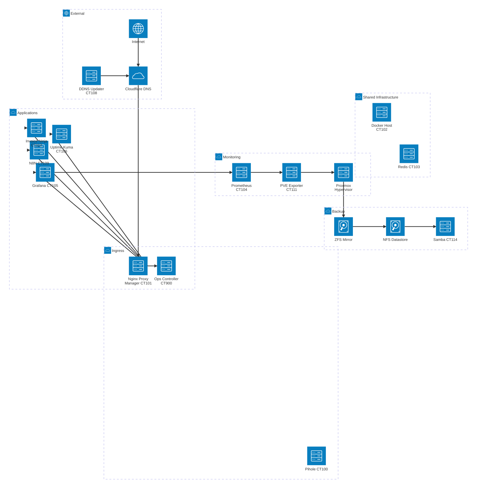

# Proxmox IaC Homelab

Infrastructure as Code for a Proxmox homelab with Terraform + Ansible, executed from a containerized toolchain.

This repository is intended to be safely modified by AI agents that add/remove LXCs and bootstrap app stacks (React/Vite/Tailwind, etc.) while keeping all infrastructure changes reproducible and tracked.

## What Is Managed Today

- Terraform provider setup for Proxmox
- One managed LXC resource: `redis` (container ID currently mapped by Terraform state)
- One Ansible playbook for Redis post-provision configuration
- Docker-based execution environment (`tf-ansible`) for Terraform + Ansible commands

## Core Principles

1. All infra changes are done through Terraform definitions in this repo.
2. Always create and review a Terraform plan before apply.
3. Keep state files out of Git history.
4. Track every meaningful infra change in Git commits.
5. Prefer repeatable bootstrap scripts over manual one-off steps.

## Prerequisites

- Docker Engine with Compose support
- Proxmox cluster reachable from this machine
- SSH key access configured for Proxmox operations
- A populated `.env` file in repo root (used by `docker-compose.yaml`)

## Execution Model (Docker Only)

All commands should run through the `tf-ansible` service.

Build image:

```bash
docker compose build
```

Open a shell in the IaC tool container:

```bash
docker compose run --rm tf-ansible sh
```

One-shot command pattern:

```bash
docker compose run --rm tf-ansible terraform version
docker compose run --rm tf-ansible ansible --version
```

## First-Time Setup

1. Build the tools image:

```bash
docker compose build
```

2. Initialize Terraform:

```bash
docker compose run --rm tf-ansible terraform init
```

3. Format and validate:

```bash
docker compose run --rm tf-ansible terraform fmt -check
docker compose run --rm tf-ansible terraform validate
```

4. Generate a plan file (mandatory before apply):

```bash
docker compose run --rm tf-ansible terraform plan -out=tfplan
```

5. Apply reviewed plan:

```bash
docker compose run --rm tf-ansible terraform apply tfplan
```

6. Run configuration management after successful apply:

```bash
docker compose run --rm tf-ansible ansible-playbook playbook.yaml
```

## Day-2 Maintenance Commands

Check current Terraform-managed resources:

```bash
docker compose run --rm tf-ansible terraform state list
```

Inspect one resource:

```bash
docker compose run --rm tf-ansible terraform state show proxmox_virtual_environment_container.redis
```

Preview changes:

```bash
docker compose run --rm tf-ansible terraform plan -out=tfplan
```

Apply changes:

```bash
docker compose run --rm tf-ansible terraform apply tfplan
```

Re-run Ansible configuration:

```bash
docker compose run --rm tf-ansible ansible-playbook playbook.yaml
```

Destroy managed resources (dangerous):

```bash
docker compose run --rm tf-ansible terraform plan -destroy -out=tfdestroy
docker compose run --rm tf-ansible terraform apply tfdestroy
```

## AI Agent Workflow Contract

When an AI agent modifies this repo, the expected flow is:

1. Define or modify Terraform LXC resource(s) in `.tf` files.
2. Pick a project slug and reuse it for container name and subdomain.
3. Run `terraform fmt` and `terraform validate`.
4. Generate a plan file (`terraform plan -out=tfplan`).
5. Record intended infra changes in a Git commit message.
6. Apply plan (`terraform apply tfplan`).
7. Run Ansible playbook if post-provision config is needed.
8. Verify resulting container(s) in Proxmox UI and with state commands.

Minimum guardrail: never run direct `terraform apply` without a saved plan file.

Naming convention guardrail:

- Project slug: `my-app`
- Container name/hostname: `my-app`
- Public domain: `my-app.krzastek.work`

## Adding a New LXC

Use `redis.tf` as the reference pattern for:

- `proxmox_virtual_environment_container` structure
- node placement
- IP/gateway initialization
- CPU/memory/disk sizing
- tags
- lifecycle ignore rules

Recommended process:

1. Add a new resource block in a dedicated file (for example `app-<name>.tf`).
2. Assign static IP, hostname, and tags.
3. Run plan and review output for only expected changes.
4. Apply plan.
5. Run bootstrap/configuration tasks.

## CT113 Clone Baseline for App Containers

1. Generate LXC
2. Add React/Vite/Tailwind stack

CT113 is a known good baseline container and should be used as the preferred source when defining new app LXCs. Keep the Terraform definition explicit so cloning behavior is reproducible and reviewable in Git.

Important: if the new container is cloned from CT113, do not run the bootstrap install/setup script again by default. CT113 already contains the prepared Node + Vite + Tailwind environment.

Run the setup script only when you intentionally want to scaffold a brand-new project inside that container.

For app bootstrap, use the container setup script pattern below (already validated in your environment):

```bash
#!/bin/bash
set -e

PROJECT_NAME="${1:-spelling-game}"
APP_DOMAIN="${PROJECT_NAME}.krzastek.work"

# Update package lists and install curl
apt-get update -y
apt-get install -y curl

# Install Node.js
curl -fsSL https://deb.nodesource.com/setup_24.x | bash -
apt-get install -y nodejs

# Create React app
npm create vite@latest "$PROJECT_NAME" -- --template react
cd "$PROJECT_NAME"

# Install dependencies
npm install
npm install lucide-react tailwindcss postcss autoprefixer @tailwindcss/vite

# Configure Tailwind
npx tailwindcss init -p
cat <<EOF > tailwind.config.js
/** @type {import('tailwindcss').Config} */
export default {
  content: ["./index.html", "./src/**/*.{js,ts,jsx,tsx}"],
  theme: { extend: {} },
  plugins: [],
}
EOF

cat <<EOF > src/index.css
@tailwind base;
@tailwind components;
@tailwind utilities;
EOF

# Allow wildcard subdomain routing via explicit host allow-list
cat <<EOF > vite.config.js
import { defineConfig } from 'vite'
import react from '@vitejs/plugin-react'
import tailwindcss from '@tailwindcss/vite'

export default defineConfig({
  plugins: [react(), tailwindcss()],
  server: {
    allowedHosts: ['${APP_DOMAIN}']
  }
})
EOF

echo "Setup complete for ${PROJECT_NAME} (${APP_DOMAIN}). Replace code in src/, then run: npm run dev -- --host 0.0.0.0"
```

Notes:

- Keep bootstrap scripts versioned in this repo if possible (for auditability).
- If setup is run inside container manually, record what was run in commit notes or docs.

## State and Git Hygiene

Current setup uses local Terraform state files (`terraform.tfstate*`).

Required practices:

- Do not commit state files.
- Do not commit `.env`.
- Do not commit temporary plan files (`tfplan`, `tfdestroy`).

If state is currently tracked in Git history, remove from index:

```bash
git rm --cached terraform.tfstate terraform.tfstate.backup
git commit -m "Stop tracking Terraform state files"
```

`.gitignore` already includes:

- `.env`
- `.terraform/`
- `*.tfstate`
- `*.tfstate.*`

Consider extending `.gitignore` with:

```gitignore
*.tfplan
tfplan
tfdestroy
```

## Suggested Change Checklist

Before merging infra changes:

1. Terraform format/validate passes.
2. Saved plan reviewed and matches intent.
3. Apply completed without unexpected resource churn.
4. Ansible run (if applicable) succeeded.
5. Proxmox UI reflects expected container state.
6. Git commit explains what changed and why.

## Known Next Improvements

- Add `variables.tf` and `terraform.tfvars` structure for cleaner multi-LXC definitions.
- Split resources by role (app, data, monitoring, etc.).
- Add remote backend + state locking for safer multi-agent/team operations.
- Add CI checks for `terraform fmt` and `terraform validate`.

